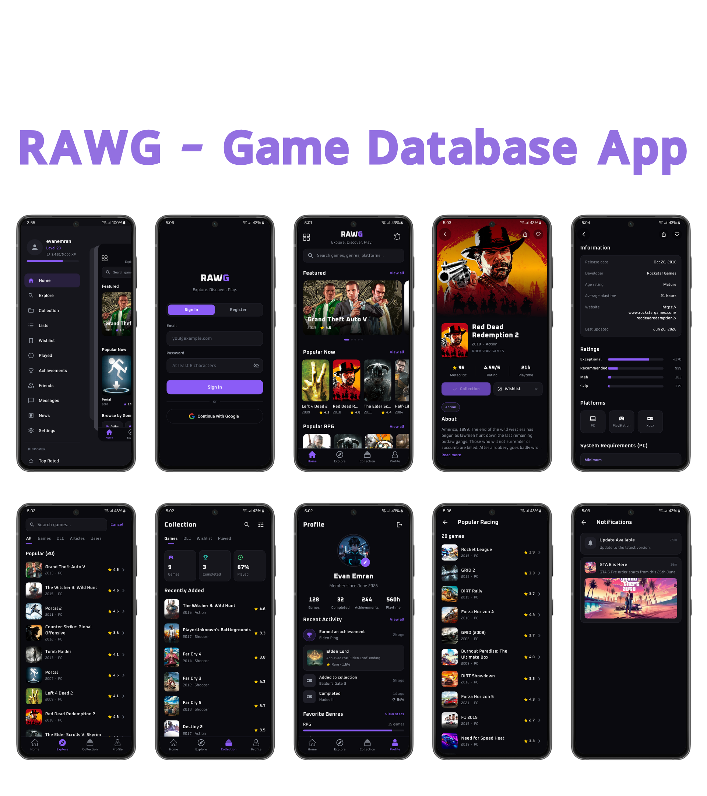

# RAWG

A modern video games discovery app built with **Flutter**. Browse trending games, search the catalog, and dive into rich game details — all powered by the [RAWG Video Games Database API](https://rawg.io/apidocs).

---

## Overview

RAWG lets you explore one of the largest open video game databases. The home screen surfaces featured and popular titles, the explore screen offers live search with infinite scrolling, and each game opens a detailed view with screenshots, platforms, ratings, system requirements, and more.

## Features

- **Home** — Featured carousel, "Popular Now" rail, and browse-by-genre chips.
- **Explore** — Live, debounced search with **lazy loading / infinite scroll** pagination.
- **Game details** — Hero artwork, description, stats (Metacritic, rating, playtime), genres, ratings breakdown, platforms, PC system requirements, stores ("where to buy"), screenshots, and tags.
- **Authentication** — Email/password sign-up and sign-in, plus Google Sign-In via Firebase Auth.
- **Profile** — User profile backed by Firestore (`name`, `email`, `profilePicture`, `joiningDate`).
- **Collection** — Save games to a personal library stored in Firestore under each user.
- **Push notifications (FCM)** — Firebase Cloud Messaging with optional notification images, an in-app notifications list, and an unread badge on the home screen.
- ** More Coming Soon

## Screenshots

Here are some screenshots.


## Tech Stack

| Concern            | Choice                                                                 |
| ------------------ | --------------------------------------------------------------------- |
| Framework          | [Flutter](https://flutter.dev) (Dart 3)                               |
| State management   | [Riverpod](https://riverpod.dev) (`flutter_riverpod`)                 |
| UI design          | **Material 3** with a custom dark theme                               |
| Networking         | [`http`](https://pub.dev/packages/http)                              |
| Data source        | [RAWG API](https://rawg.io/apidocs)                                  |
| Authentication     | [Firebase Auth](https://firebase.google.com/docs/auth) + [Google Sign-In](https://pub.dev/packages/google_sign_in) |
| Backend / storage  | [Cloud Firestore](https://firebase.google.com/docs/firestore)        |
| Push notifications | [Firebase Cloud Messaging](https://firebase.google.com/docs/cloud-messaging) + [`flutter_local_notifications`](https://pub.dev/packages/flutter_local_notifications) |

## Architecture

The project follows **Clean Architecture**, separating the code into three layers with a clear, one-directional dependency flow (`presentation → domain ← data`):

- **Domain** — Pure business layer. Holds models, repository contracts (abstractions), and use cases. It has no dependency on Flutter or any external package implementation.
- **Data** — Implements the domain repository contracts. Talks to the RAWG API and maps raw JSON into domain models.
- **Presentation** — Flutter UI (pages and widgets) plus Riverpod providers that wire use cases to the screens.

This keeps the UI decoupled from the network layer: pages depend on use cases, use cases depend on repository abstractions, and only the data layer knows about the actual API.

Firebase is integrated through the same pattern — auth, Firestore, and FCM each have domain repository contracts, data-layer implementations, and Riverpod providers consumed by the presentation layer.

### Firebase

The app uses Firebase for user accounts, persisted user data, and push notifications.

#### Firebase Auth

- Users sign in with **email/password** or **Google Sign-In**.
- [`AuthGate`](lib/presentation/pages/auth_gate.dart) listens to auth state and routes to the login screen or the main app shell.
- On sign-up, a user document is created in Firestore.

#### Cloud Firestore

User data is stored under the `users` collection:

| Path | Purpose |
| ---- | ------- |
| `users/{userId}` | Profile fields (`name`, `email`, `profilePicture`, `joiningDate`, `fcmToken`) |
| `users/{userId}/collection/{gameId}` | Saved games in the user's collection |
| `users/{userId}/notifications/{notificationId}` | Notification history (`title`, `body`, `imageUrl`, `read`, `createdAt`) |

Firestore security rules should restrict each user to their own documents and subcollections (read/write only when `request.auth.uid == userId`).

#### Firebase Cloud Messaging (FCM)

- Device tokens are saved on the user document when the user is signed in.
- Incoming messages are persisted to Firestore and surfaced in the in-app **Notifications** screen.
- Foreground notifications are displayed locally with [`flutter_local_notifications`](https://pub.dev/packages/flutter_local_notifications), including **Big Picture** style when a notification image URL is provided.
- An unread count badge is shown on the home screen notification icon.

Push messages can include an image via the FCM notification payload or a data field (`imageUrl` or `image`). Image URLs must be **HTTPS** and publicly accessible.

### Data flow

```
Widget → Provider → UseCase → Repository (abstract) → RepositoryImpl → RawgApi → RAWG
```

### Project structure

```
lib/
├── main.dart                     # App entry point + ProviderScope + Firebase init
├── firebase_options.dart         # Generated Firebase platform config
├── firebase_messaging_background.dart  # FCM background message handler
├── app/
│   ├── constants/                # API base URL, key, endpoint paths, Firebase constants
│   └── theme/                    # Material 3 dark theme + color palette
├── data/
│   ├── providers/                # RawgApi (HTTP client wrapper)
│   ├── repositories/             # Repository implementations (RAWG, auth, collection, notifications)
│   └── services/                 # FCM + local notification services
├── domain/
│   ├── models/                   # Data models (Games, GameSingle, AppUser, AppNotification, ...)
│   ├── repositories/             # Repository abstractions (contracts)
│   └── usecases/                 # Use cases (GetGames, SearchGames, auth, collection, notifications, ...)
└── presentation/
    ├── pages/                    # Screens (home, explore, details, auth, profile, notifications, ...)
    ├── providers/                # Riverpod providers
    └── widgets/                  # Reusable UI components
```

## State Management

State is managed with **Riverpod**. The dependency graph is composed from small, testable providers:

- `rawgApiProvider` → `rawgRepositoryProvider` → use-case providers (e.g. `getGamesProvider`, `searchGamesProvider`).
- `FutureProvider.family` providers expose async data to the UI (e.g. games list, game details, genres) with automatic loading/error/data states.
- Lightweight UI state (selected bottom-nav tab, drawer selection) uses `StateProvider`.

## Getting Started

### Prerequisites

- [Flutter SDK](https://docs.flutter.dev/get-started/install) (Dart 3.x)
- A device or emulator/simulator
- A [Firebase](https://console.firebase.google.com) project with **Authentication**, **Cloud Firestore**, and **Cloud Messaging** enabled

### Setup

1. Clone the repository and fetch dependencies:

   ```bash
   git clone <repo-url>
   cd rawg_app
   flutter pub get
   ```

2. Add your RAWG API key.

   Get a free key from [rawg.io/apidocs](https://rawg.io/apidocs) and set it in `lib/app/constants/api_constants.dart`:

   ```dart
   static const String apiKey = "YOUR_RAWG_API_KEY";
   ```

3. Configure Firebase.

   - Create a Firebase project and register Android (and iOS if needed) apps.
   - Enable **Email/Password** and **Google** sign-in providers under Authentication.
   - Create a **Cloud Firestore** database.
   - Add Firestore security rules so users can only access their own data and subcollections (`collection`, `notifications`).
   - Use the [FlutterFire CLI](https://firebase.flutter.dev/docs/overview) to generate `lib/firebase_options.dart`:

     ```bash
     dart pub global activate flutterfire_cli
     flutterfire configure
     ```

   - Place `google-services.json` (Android) and `GoogleService-Info.plist` (iOS) in the platform folders as required by your Firebase setup.

4. Run the app:

   ```bash
   flutter run
   ```

## API Attribution

Game data and images are provided by the [RAWG Video Games Database API](https://rawg.io/apidocs). Per RAWG's terms of use, attribution to RAWG as the data source is required.
